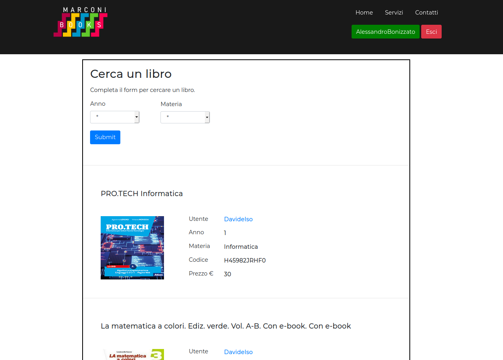

# Marconi Books User Guide

**Team 4 March 4, 2020**

**Team Members**: Matta Sandrini, Davide Isoni, Alessandro Bonizzato

# 1.0 Introduction

ITI Marconi web site allows users a simple interface to access their account information from a mobile device. Quick Start Guide.

1. Enter Marconi Book website&#39;s page. The login screen will be brought up.

2. Enter your Username and Password.

3. Tap the Login button.

4. If you have not an account yet, create one pressing &quot;Registrati&quot;.

5. Then login.

# 2.0 Main Scenarios of Use

## 2.1 Search a Book

1. Tap the &quot;Inizia a cercare&quot; button. The Search Menu will be brought up.

2. Enter book&#39;s data.
3. Tap the &quot;Submit&quot; button.
4. Matched books will be displayed.

## 2.2 Add a Book

1. Tap the &quot;Aggiungi un libro&quot; button. The Add Menu will be brought up.

2. Enter book&#39;s data.
3. Tap the &quot;Submit&quot; button.
4. Go on your personal page to check the addition.

## 2.3 Check you personal page

1. Tap the green button at the top of the page. Your personal page will be brought up.

2. You can modify your personal data.
3. Scrolling down the page, you can check your book and remove it.

4. To logout, you simply have to click the red button at the top of the menu.
